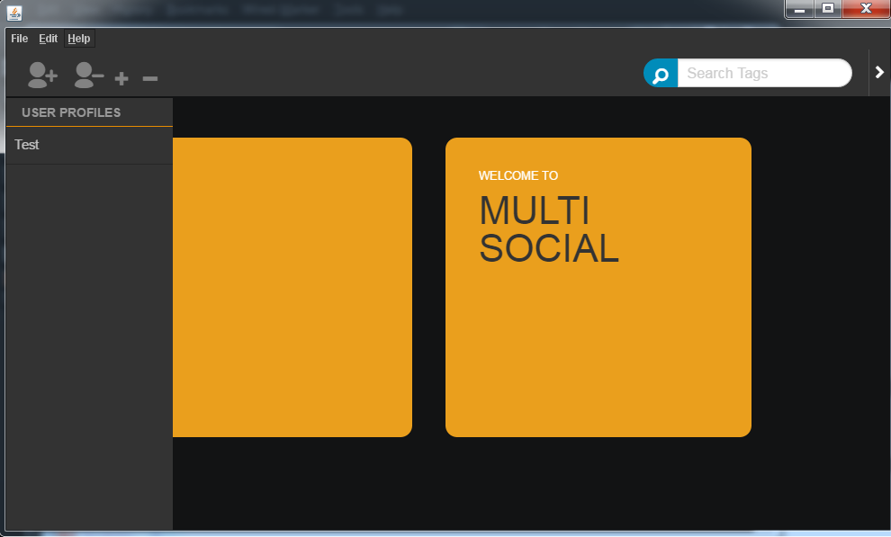
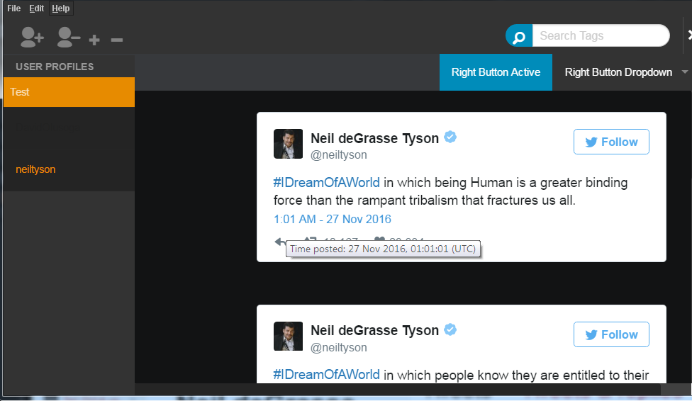

# Multi Social   
A basic programs that allows the user to keep track of multiple social media profilels.    
It currently works with Twitter, Youtube and ~~Instagram~~ (Instagram recently changed their api so the instagram functionality will not work).   

### Screenshots  
   
  

### Download   
Contact me for a link to the executable JAR file.   

### Run and Execute   
Open up the command line and enter  **run.bat**   
or alternatively enter `java -Djava.library.path="jcef" -jar multi2.jar`

